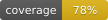

# delphi-forms-parser


[](https://www.embarcadero.com/products/delphi)
[](assets/coverage/CodeCoverage_Summary.md)
[](https://opensource.org/licenses/MIT)
[](https://github.com/continuous-delphi)

A standalone parser for Delphi VCL and FMX form files (.dfm/.fmx) in both text
and binary formats. Produces a typed AST with full round-trip fidelity.

---

## Features

- **Text DFM/FMX parsing** -- lexer + recursive-descent parser for the text
  form file format
- **Binary DFM parsing** -- reads the TPF0 binary format used by older Delphi
  versions
- **Text writer** -- serialize AST back to text DFM with byte-for-byte
  round-trip fidelity
- **Binary writer** -- serialize AST back to binary DFM format with original
  value type tag preservation
- **Format detection** -- auto-detect text vs binary format
- **Encoding detection** -- auto-detect UTF-8 BOM; explicit `TEncoding`
  overloads for legacy ANSI-encoded files
- **Cross-format conversion** -- binary-to-text and text-to-binary conversion
  for migration workflows
- **Typed collection items** -- supports `item ClassName ... end` syntax
- **TreeDump utility** -- CLI tool for inspecting DFM/FMX component trees
- **FormStats utility** -- codebase-wide component and property statistics
  with recursive directory scanning

## Quick start

```pascal
uses
  Delphi.Forms,
  Delphi.Forms.Types;

var
  FormFile: TFormFile;
begin
  // Parse a DFM file (auto-detects text vs binary format)
  FormFile := TDelphiFormsParser.ParseFile('MyForm.dfm');
  try
    // Access the component tree
    WriteLn('Root: ', FormFile.Root.Name, ': ', FormFile.Root.ClassName_);
    WriteLn('Children: ', FormFile.Root.Children.Count);
    WriteLn('Properties: ', FormFile.Root.Properties.Count);

    // Round-trip: write back to text
    WriteLn(TDelphiFormsParser.WriteText(FormFile));
  finally
    FormFile.Free;
  end;
end;
```

### Legacy ANSI files

For pre-Unicode Delphi projects (Delphi 7 through 2007) with ANSI-encoded
DFM files:

```pascal
FormFile := TDelphiFormsParser.ParseFile('LegacyForm.dfm', TEncoding.ANSI);
```

### Binary-to-text conversion

```pascal
var
  TextDfm: string;
begin
  TextDfm := TDelphiFormsParser.BinaryToText(TFile.ReadAllBytes('OldForm.dfm'));
  TFile.WriteAllText('OldForm.dfm', TextDfm);
end;
```

## Supported value types

| Type | Text example | Binary tag |
|------|-------------|------------|
| Integer | `123`, `-5`, `$FF` | vaInt8, vaInt16, vaInt32, vaInt64 |
| Float | `3.14`, `-1.5E2` | vaSingle, vaDouble, vaExtended, vaCurrency, vaDate |
| String | `'Hello'`, `'line1'#13#10'line2'` | vaString, vaLString, vaWString, vaUTF8String, vaUString |
| Boolean | `True`, `False` | vaTrue, vaFalse |
| Identifier | `clRed`, `poScreenCenter` | vaIdent |
| Set | `[ssDouble, ssBold]`, `[]` | vaSet |
| Binary | `{ 0A544A5045... }` | vaBinary |
| List | `(item1 item2)` | vaList |
| Collection | `< item ... end>` | vaCollection |

## Design invariants

1. **Text round-trip** -- parse text DFM, write back: output matches original
   byte-for-byte
2. **Binary round-trip** -- read binary DFM, write back: output matches original
   byte-for-byte
3. **Token coverage** -- every character in text DFM appears in exactly one token
4. **Deterministic** -- same input always produces same output

## Architecture

```
Text DFM ---> TDfmLexer ---> TDfmTokenList ---> TDfmParser ---> TFormFile (AST)
Binary DFM ---> TDfmBinaryReader -----------------------------------^
                                                                    |
TFormFile ---> TDfmTextWriter ---> text DFM output                  |
TFormFile ---> TDfmBinaryWriter ---> binary DFM output              |
```

## Facade API

| Method | Description |
|--------|-------------|
| `ParseFile(FileName)` | Auto-detect format, parse file |
| `ParseFile(FileName, Encoding)` | Parse with explicit encoding |
| `ParseText(Source)` | Parse text DFM string |
| `ParseBinary(Data)` | Parse TPF0 binary bytes |
| `ParseBytes(Data)` | Auto-detect format from bytes |
| `ParseBytes(Data, Encoding)` | Auto-detect with explicit encoding |
| `WriteText(FormFile)` | Serialize AST to text DFM |
| `WriteBinary(FormFile)` | Serialize AST to TPF0 binary |
| `BinaryToText(Data)` | Convert binary DFM to text |
| `TextToBinary(Source)` | Convert text DFM to binary |
| `DetectFormat(Data)` | Returns `dfText` or `dfBinary` |
| `IsBinaryDfm(Data)` | Check for TPF0 signature |

## TreeDump utility

CLI tool for inspecting DFM/FMX component trees:

```
Delphi.Forms.TreeDump.exe MyForm.dfm --round-trip

object frmMain: TfrmMain
  Left = 0 [fvInteger]
  Caption = 'Hello' [fvString]
  Font.Style = [] [fvSet]
  object Button1: TButton
    Caption = 'Click' [fvString]
  end
end

Properties: 3; Children: 1
Round-trip: Pass
Exit Code: 0
```

Options: `--no-values`, `--round-trip`, `--format:json`, `-v`, `-?`

## FormStats utility

CLI tool for component and property statistics across a codebase:

```
Delphi.Forms.FormStats.exe C:\code\legacy-app\source --recursive

Delphi.Forms.FormStats
Path: C:\code\legacy-app\source
Files: 47 (42 text, 5 binary)

Components:     312
Unique classes: 28
Properties:     4,218
Max depth:      7
Avg depth:      2.3

Value types:
  fvInteger:      1842 ( 43.7%)
  fvString:       1204 ( 28.5%)
  ...

Top 10 classes:
  TLabel               87
  TButton              42
  ...

Parse failures: 0
```

Options: `--recursive`, `--format:json`, `--top:N`, `-v`, `-?`

---

## Maturity

This repository is currently `incubator` and is under active development. It will graduate to `stable` once:

- At least one downstream consumer exists.

Until graduation, breaking changes may occur

---


## Part of Continuous Delphi

This tool is part of the [Continuous-Delphi](https://github.com/continuous-delphi)
ecosystem, dedicated to the long-term success of Delphi applications.